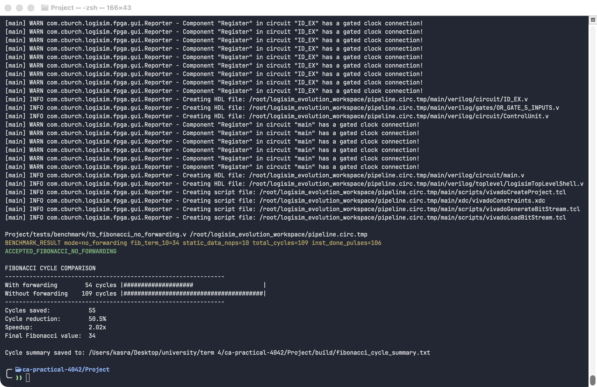
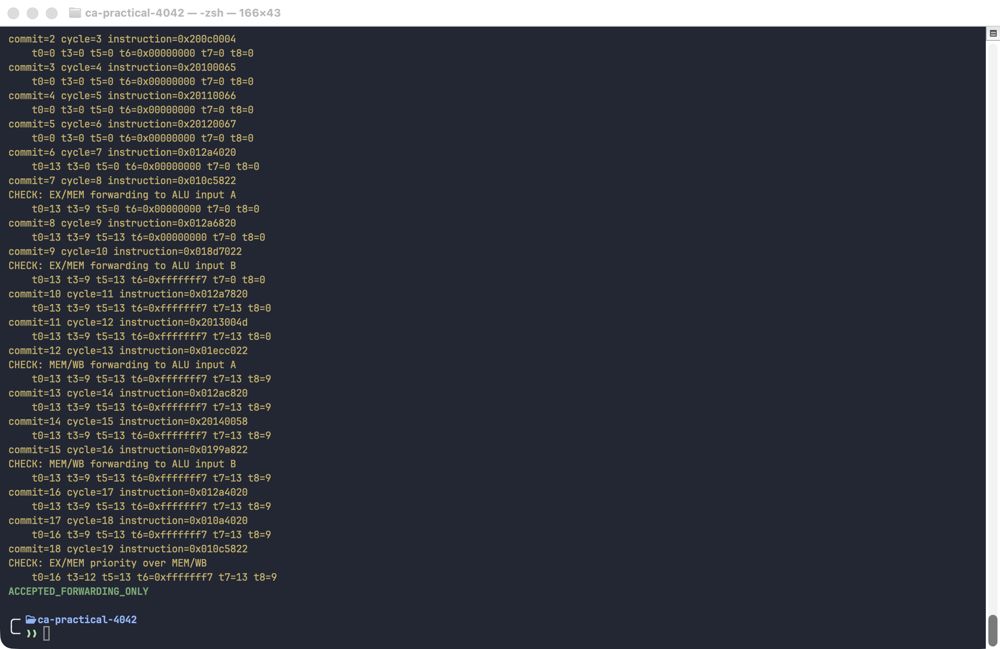
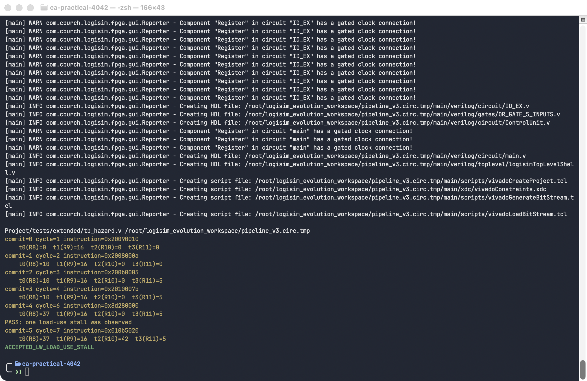
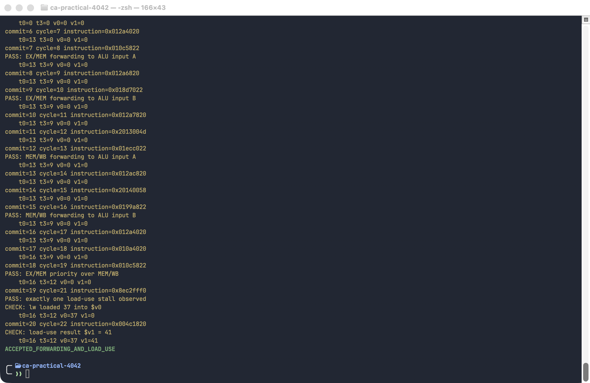

# CA Project 8 - Data Forwarding Unit

This project extends a 32-bit, single-issue, five-stage MIPS pipeline with
data forwarding and load-use hazard detection. It includes the final processor,
a processor without forwarding for comparison, self-checking Verilog
testbenches, assembly programs, ROM words, and local and Docker test runners.

## What the circuit does

The processor uses the standard five pipeline stages:

```text
IF -> ID -> EX -> MEM -> WB
```

Without forwarding, a dependent instruction must wait until its input has been
written back to the register file. The forwarding processor avoids most of
these waits by sending newer values directly to the ALU inputs.

The forwarding processor writes its register file on the falling clock edge.
Pipeline registers advance on the rising edge, so an instruction in decode can
see a value written back during the same clock cycle. This matters for tight
loops such as the Fibonacci benchmark.

The `ForwardingUnit` produces two 2-bit signals:

| Signal value | ALU input source |
|---|---|
| `00` | Value read from the register file through `ID/EX` |
| `10` | Newer ALU result from `EX/MEM` |
| `01` | Write-back value from `MEM/WB` |

`ForwardA` controls ALU input A and `ForwardB` controls ALU input B. If both
`EX/MEM` and `MEM/WB` match the same source register, `EX/MEM` has priority
because it contains the newer value. Register zero is never forwarded as a
writable destination.

A load-use dependency cannot be solved immediately because load data is not
available until after the memory stage. The `Hazard_Detection` unit therefore:

1. freezes the PC and `IF/ID` register for one cycle;
2. inserts one bubble into `ID/EX`;
3. forwards the loaded value from `MEM/WB` on the following cycle.

The project-required instruction set includes:

- R-type: `add`, `sub`, `and`, `or`, `slt`
- I-type: `lw`, `sw`, `addi`, `beq`
- Control: `j`

## Processor files

- `Full_Pipeline/pipeline_v5.circ`: final processor with forwarding and hazard detection
- `Pipeline/pipeline.circ`: baseline processor without forwarding

The top-level simulation interface contains `clk`, `rst`, `Jen`, `Jin`,
`Jout`, `InstDone`, and register outputs `R0` through `R31`. The testbenches use
`Jen` and `Jin` to load data memory followed by instruction memory, reset the
processor, run the program, and inspect architectural register results.

## Folder layout

```text
Full_Pipeline/                  Final forwarding processor
Pipeline/                       Baseline processor
tests/scenarios/                Two required Project 8 scenarios
tests/benchmark/                Fibonacci(10) cycle comparison
tests/extended/                 Additional forwarding and hazard tests
tests/optional/                 Optional bonus branch experiment
programs/scenarios/             Scenario assembly and ROM words
programs/fibonacci/             Fibonacci assembly and ROM words
docs/                           Detailed scenario and benchmark notes
scripts/                        Bare-metal and Docker runner wrappers
```

## Assembly and hex program files

The `.asm` files are the readable programs. The matching `.hex` files contain
the same instructions as 32-bit machine words, one word per line. The first
line is instruction address 0, the second is address 1, and so on. For example:

```text
201d0800    addi $sp, $zero, 2048
00004020    add  $t0, $zero, $zero
20090001    addi $t1, $zero, 1
20040008    addi $a0, $zero, 8
```

A NOP is `00000000`. Branch and jump targets are already encoded in the hex
words, so moving a label requires regenerating those affected words.

The supplied testbenches place these same words into an `instructions` array.
They then assert `Jen` and feed `Jin` in reverse array order because the
processor's loader is a shift-register interface: data memory is shifted in
first, followed by instruction memory. The `.hex` files are therefore useful
for checking the encodings, loading an array with `$readmemh`, or copying words
into another testbench; the runner does not execute assembly text directly.

## Test suites

### Required scenarios

Scenario 1 checks direct EX/MEM forwarding:

```mips
add $t0, $t1, $t2
sub $t3, $t0, $t4
```

The dependent `sub` must execute without a stall and produce `$t3 = 9`.

Scenario 2 checks a load-use dependency:

```mips
lw  $t0, 0($t1)
add $t2, $t0, $t3
```

The processor must insert exactly one bubble and then produce `$t2 = 42`.
The reference test runs the same dependencies on the baseline processor using
hand-inserted NOPs.

### Fibonacci benchmark

Both processors run the same loop with `F(0)=0`, `F(1)=1`, and a loop counter
of eight. After eight iterations the tenth displayed sequence value is `34` in
`$t1`; `$t0` is `21` and `$v0` is `34`.

The baseline program follows the manually scheduled code with three initial
NOPs, three NOPs before copying `$v0`, and four NOPs before `bnez`. The
forwarding program removes all data-hazard NOPs. Both programs keep the NOPs
after `bnez` and `j` as control delay slots.

| Processor | Dynamic data NOPs | Cycles to result | `$t1` |
|---|---:|---:|---:|
| With forwarding | 0 | 54 | 34 |
| Without forwarding | 59 | 109 | 34 |

Forwarding saves 55 cycles, a 50.5% reduction and about a 2.02x speedup. See
`docs/BENCHMARK_RESULTS.md` for the exact stopping condition, programs, and ROM
words.

## Option 1: bare-metal runner

The bare-metal runner exports the Logisim circuit to Verilog, compiles it with
Icarus Verilog, and executes the selected testbench directly on the host.

### Requirements

- Java runtime compatible with the included `logisim.jar`
- Icarus Verilog (`iverilog` and `vvp`)
- Python 3

macOS with Homebrew:

```sh
brew install openjdk icarus-verilog python
```

Ubuntu/Debian:

```sh
sudo apt update
sudo apt install default-jre iverilog python3 python-is-python3
```

Arch Linux:

```sh
sudo pacman -S jre-openjdk iverilog python
```

### Run from the `Project` folder

```sh
# Required forwarding scenarios and baseline reference
./scripts/run_required_tests.sh --local

# Fibonacci comparison
./scripts/run_benchmarks.sh --local

# Forwarding, hazard, and combined extended tests
./scripts/run_extended_tests.sh --local

# Everything above
./scripts/run_all_tests.sh --local
```

`--local` is the default, so it may be omitted:

```sh
./scripts/run_all_tests.sh
```

The benchmark runner prints a combined cycle comparison after both simulations
pass. It also saves the clean summary to
`build/fibonacci_cycle_summary.txt`; the two complete simulation logs are saved
beside it. A successful run currently ends with:

```text
FIBONACCI CYCLE COMPARISON
---------------------------------------------------------------
With forwarding        54 cycles |####################                    |
Without forwarding    109 cycles |########################################|
---------------------------------------------------------------
Cycles saved:           55
Cycle reduction:        50.5%
Speedup:                2.02x
Final Fibonacci value:  34
```

### Full Terminal screenshot

This is a window-only macOS Terminal capture taken after running the complete
Docker benchmark command. It includes the no-forwarding result and final cycle
comparison produced by the script itself.



For the baseline simulation, the runner creates an ignored no-space symbolic
link under `build/`. This only works around a quoting limitation in the shared
synthesis helper; the actual circuit being tested remains
`Pipeline/pipeline.circ`.

To run one testbench directly:

```sh
../scripts/synth_valid.sh \
    Full_Pipeline/pipeline_v5.circ \
    tests/scenarios/tb_scenario1_ex_hazard.v
```

## Option 2: Docker runner

The Docker runner uses the repository-level `Dockerfile` and `judge.sh`. The
container includes Java, Icarus Verilog, Python, and the libraries required by
the test scripts.

### Requirements

- Docker Desktop on macOS/Windows, or Docker Engine on Linux
- Docker Desktop/daemon running

### Build the image once

From the `Project` folder:

```sh
./scripts/build_docker.sh
```

This builds the image named `myenv:latest`. Rebuild it only after changing the
`Dockerfile`, its installed packages, or the container entrypoint.

### Run through Docker

```sh
# Required forwarding scenarios and baseline reference
./scripts/run_required_tests.sh --docker

# Fibonacci comparison
./scripts/run_benchmarks.sh --docker

# Forwarding, hazard, and combined extended tests
./scripts/run_extended_tests.sh --docker

# Everything above
./scripts/run_all_tests.sh --docker
```

The wrappers move to the repository root before calling `judge.sh`, ensuring
that Docker mounts the complete repository and receives valid `Project/...`
paths.

To run one test directly without a wrapper, start from the repository root
(the directory containing `Dockerfile` and `judge.sh`):

```sh
./judge.sh \
    Project/Full_Pipeline/pipeline_v5.circ \
    Project/tests/scenarios/tb_scenario1_ex_hazard.v
```

If pulling the base image is blocked in your network, configure an appropriate
Docker registry mirror in Docker Desktop or the Docker daemon configuration,
then rebuild with `./scripts/build_docker.sh`.

## Expected successful output

The complete required, extended, and benchmark suites should produce these
final markers:

```text
ACCEPTED_SCENARIO_1_EX_HAZARD
ACCEPTED_SCENARIO_2_LOAD_USE
ACCEPTED_SCENARIOS_WITHOUT_FORWARDING
ACCEPTED_FORWARDING_ONLY
ACCEPTED_LW_LOAD_USE_STALL
ACCEPTED_FORWARDING_AND_LOAD_USE
ACCEPTED_FIBONACCI_FORWARDING
ACCEPTED_FIBONACCI_NO_FORWARDING
```

### Full Docker judge Terminal screenshots

Forwarding paths:



Load-use hazard and one-cycle stall:



Combined forwarding and load-use hazard:



Any `FAILED_...` marker is preceded by a specific error such as an incorrect
register value, unexpected stall count, or timeout.

The files under `tests/extended/` provide additional coverage. The bonus branch
experiment under `tests/optional/` is not part of the required test runners.

## Generated files

The runners may generate `.out` and `.circ.tmp` files. These are reproducible
build artifacts and are ignored by `.gitignore`; they are not project sources.

Logisim-generated Verilog is normally placed in:

```text
~/logisim_evolution_workspace/
```

## Troubleshooting

- `Docker Desktop/daemon is not running`: start Docker and rerun the command.
- `myenv:latest is missing`: run `./scripts/build_docker.sh` once.
- `iverilog: command not found`: install Icarus Verilog for bare-metal runs.
- Java errors while exporting Logisim: install a current Java runtime and make
  sure `java` is available on `PATH`.
- A test times out: check reset behavior, PC/IF-ID stall control, bubble
  insertion, and the forwarding paths.
- A result is wrong without a timeout: check destination-register matching,
  `RegWrite`, the `$zero` exclusion, and EX/MEM priority over MEM/WB.
